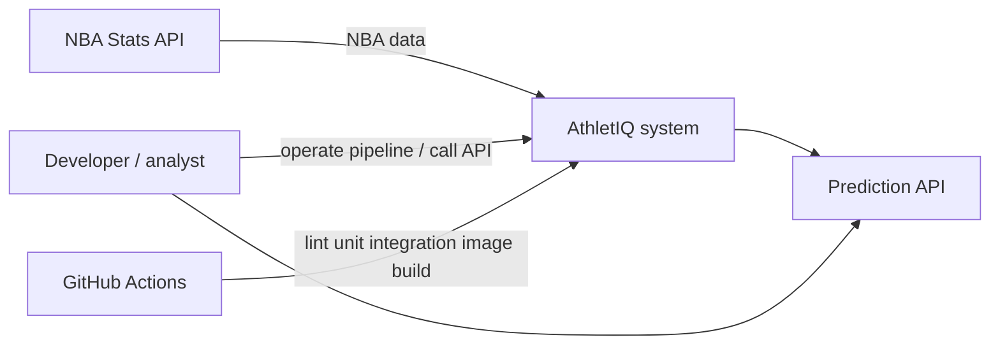
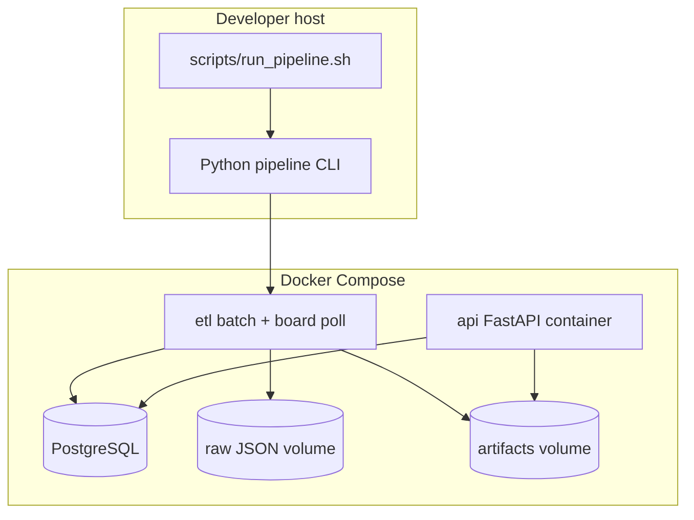
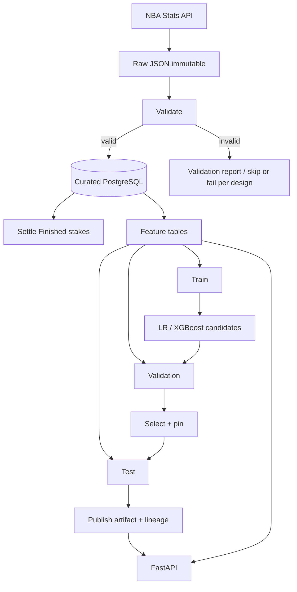
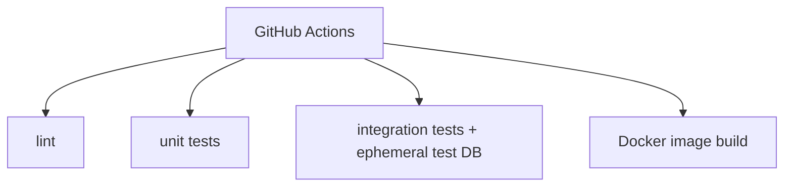

# System architecture

Status: Approved  
Owner: Project owner  
Last Updated: 2026-08-16  
Version: 1.2.0

> Logical + deployment views. Data lifecycle: `data-architecture.md`. API: `api-architecture.md`.  
> Sources: SRS v1.1+; architecture Grill-Me; owner reviews (2026-08-12).

## Architectural invariants

1. **No leakage:** No information generated after a game's prediction timestamp may influence its features, model selection, or evaluation.  
   - *Feature leakage:* `Feature(t) ⊆` information available at prediction time `t`.  
   - *Model-selection leakage:* Test set never used for model selection or hyperparameter/feature-definition changes.  
   - *Temporal leakage:* Training labels/features for a game at `T` never use information `> T`.
2. **Deterministic pipeline:** Same raw dataset + code version + config + seed → reproducible training within documented tolerances.
3. **Idempotent curated loads:** Re-running transform/load on the same raw input does not duplicate logical curated/feature records.
4. **Test isolation:** Test data is never used to select models, tune hyperparameters, or modify feature definitions.
5. **Artifact/API consistency:** The API serves only a **published** model artifact for the game’s `league` with its compatible `feature_version` / preprocessing (ADR-013).
6. **CR-005:** Browser talks only to AthletIQ. Adapter is the only `nbaapi.com` client. No Kafka/Redis/WebSockets. E-coin ledger is not a book (ADR-014). Settle is a pipeline stage (ADR-015).

## CR-005 logical components

| Component | Role |
|---|---|
| Pipeline (etl) | Uncapped live NBA page + player boxes; persist scheduled/in-progress; **settle** Finished stakes |
| Board poll | Compose loop: newest-page upsert of in-progress NBA games |
| API | Predict + slate/board/ledger JSON; static `GET /`, `/slate`, `/board` |

## 1. System context

Answers: *What systems interact with AthletIQ?*



Source: `diagrams/system-context.mmd`.

## 2. Container / deployment (MVP)

Answers: *Where does everything run?*



Source: `diagrams/deployment.mmd`.

| Kind | Component | Role |
|---|---|---|
| Container | `database` | Curated PostgreSQL |
| Container | `etl` | **Packaging** of all batch logical components (below); also the image used for **board poll** (`python -m athletiq.board_poll` or documented equivalent) |
| Container | `api` | Synchronous prediction API |
| Volume | raw | Immutable provider JSON |
| Volume | artifacts | Models, metrics, lineage metadata, **per-league** selection pins |
| Host | `scripts/run_pipeline.sh` | Thin entry → Python CLI |
| External | NBA Stats API, GitHub Actions | Provider; CI quality + image build |

### ETL container vs logical components

Logical pipeline stages are **separated by responsibility in code**, but for MVP they are **packaged into a single batch (`etl`) container** — not independently deployable microservices. This is deliberate scope control, not an accident.

Logical stages inside the batch package:

```text
Adapter → Ingest → Validate → Transform/Load → Settle open stakes on newly Finished games
  → (Analytics) → Feature build → Train → Validation scoring → Model selection → Test-once eval → Publish artifact
```

## 3. Data / ML pipeline

Answers: *How does data move through the ML system?* (detail in `data-architecture.md`)



Source: `diagrams/data-ml-pipeline.mmd`.

Baselines are **deterministic/reference predictors** (not necessarily fitted models), defined in ML design, evaluated on the **same** temporal splits as candidates.

## 4. Inference feature contract

**MVP decision (ADR-008):** Predictions are keyed by an existing **`game_id`** (scheduled/known contest). Features are **precomputed** and stored as rows uniquely identified by `(game_id, feature_version)`.

```text
HTTP predict(game_id)
  → validate request
  → load feature row (game_id, pinned feature_version)
  → shared preprocessing (same code/spec as training)
  → load pinned model artifact
  → synchronous inference
  → response + lineage (model_version, feature_version, …)
```

- MVP optional resolver is **`provider_game_id`** only. Home/away/date matchup is **Future / not MVP** — not an excuse to re-derive features ad hoc in the API.  
- API does **not** train, fetch provider history, mutate datasets, or select models per request.  
- Predictions are **synchronous** (single HTTP request lifecycle). No invented latency SLO.

## 5. Lineage (dataset → model → API)

Every **published** model must identify at least:

| Field | Meaning |
|---|---|
| `model_version` | Published artifact id |
| `feature_version` | Feature definition + preprocessing contract |
| `dataset_version` | Curated/feature snapshot id used to train |
| `code_commit` | Git commit of training/feature code |
| `training_config` | Documented train config / seed |

API serves only a published pin compatible with that lineage (invariant 5). Lightweight JSON/table — not MLflow.

## 6. CI vs local pipeline



Source: `diagrams/ci.mmd`.

**NFR:** CI must **not** depend on availability, rate limits, or mutable live responses from the live NBA provider (fixtures/recorded payloads only).

Local/scheduled pipeline may call the real provider; that path is outside default CI.

## 7. Trust boundaries (MVP)

| Boundary | Control |
|---|---|
| Provider | API key via env → ETL only |
| API | Demo bind; validation; sync request |
| DB / volumes | Env credentials; host FS permissions |
| CI | No live provider; secrets via GHA secrets if any |

## 8. Failure domains

| Class | Behavior |
|---|---|
| Execution failure | Non-zero exit; operator may rerun selected stages (`--from-stage`). Restart support is limited (ADR-005): train from `feature_matrix.npz`; features requires in-process store. State file is not restored. |
| Quality gate failure | Eval/ML-005 miss recorded; need not crash infra |
| Validation | Valid → transform; invalid → report; stop vs skip = design |
| Missing pin/features | API health/predict fail clearly |

## 9. Scalability

Single-node Compose. Scaling mechanisms deferred until a real requirement exists. **No** Kafka/Airflow/K8s/MLflow/Redis/Spark/cloud warehouse/feature-store unless justified later.

## 10. ADR index (binding)

| ADR | Topic | Status |
|---|---|---|
| [ADR-001](../05-decisions/ADR-001-postgresql.md) | PostgreSQL | Accepted |
| [ADR-002](../05-decisions/ADR-002-api-sports-provider.md) | API-Sports | Superseded |
| [ADR-011](../05-decisions/ADR-011-nba-stats-api-provider.md) | NBA Stats API | Accepted |
| [ADR-003](../05-decisions/ADR-003-served-model-selection.md) | Val select / test once | Accepted |
| [ADR-004](../05-decisions/ADR-004-artifact-storage.md) | Local artifacts | Accepted |
| [ADR-005](../05-decisions/ADR-005-training-as-batch.md) | Batch + Python orchestrator | Accepted |
| [ADR-006](../05-decisions/ADR-006-raw-landing.md) | Immutable raw JSON FS | Accepted |
| [ADR-008](../05-decisions/ADR-008-inference-feature-contract.md) | `game_id` + precomputed features | Accepted |
| [ADR-009](../05-decisions/ADR-009-no-auth-mvp-api.md) | No auth MVP API | Accepted |
| [ADR-010](../05-decisions/ADR-010-bigint-surrogate-keys.md) | BIGINT surrogate keys | Accepted |
| [ADR-012](../05-decisions/ADR-012-synthetic-odds-snapshots.md) | Synthetic Market P | Accepted |
| [ADR-013](../05-decisions/ADR-013-per-league-selection-pins.md) | Per-league pins | Accepted |
| [ADR-014](../05-decisions/ADR-014-demo-identity-ecoin-ledger.md) | Demo identity + e-coin ledger | Accepted |
| [ADR-015](../05-decisions/ADR-015-game-lifecycle-board-poll-settle.md) | Scheduled persist, board poll, settle | Accepted |
| [ADR-016](../05-decisions/ADR-016-three-ui-surfaces.md) | `GET /`, `/slate`, `/board` | Accepted |
| [ADR-017](../05-decisions/ADR-017-uncapped-nba-live-player-boxes.md) | Uncapped live NBA + player boxes (extends ADR-011) | Accepted |

**Future consideration (not an ADR yet):** candidate cloud host GCP when Gate 8 is designed. Former ADR-007 deferred — see `../05-decisions/ADR-007-post-mvp-gcp.md` (Proposed / non-binding) or ignore until CD.

## Related

- `data-architecture.md` — zones, raw replay, validation boundary  
- `api-architecture.md` — sync predict contract  
- Gate 4 design — schema, feature formulas, season cuts, metadata JSON shape
